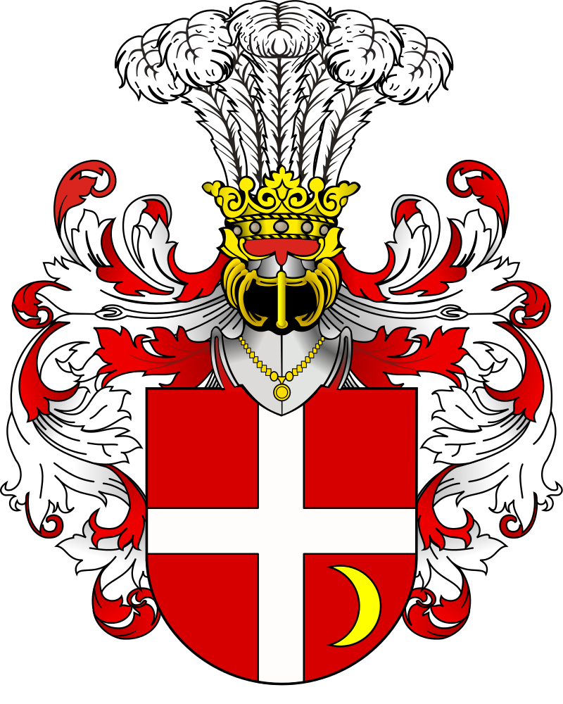

# BYSTRAM FAMILY TREE
Version 0.9.0

## Summary

The goal of this project is to create a printable family tree for my uncle Alex using the excellent [data gathered by Krzysztof Bystram](https://cornelis.bystram.be/).

## Updates

- **2021-12-28**: Began project. Downloaded data from [Bystram family website](https://cornelis.bystram.be/)
- **2022-02-20**: First draft completed. Sent to Catherine Plowright for first review.

## Processing

#### 1) Downloading data

I followed the following process to for downloading data:

1. For every person along the patrilineal line between Eugeniusz Bystram (`I285`, generation 16) and Gotthard IV (`I187`, generation 7), I downloaded 3 generations of ancestors and 3 generations of descendants
2. I also downloaded 8 generations of _descendants_ from Wladyslaw Bystram (`I109`, generation 14) in order to capture distant present-day cousins
3. I also downloaded 8 generations of _ancestors_ from Gotthard IV (`I187`, generation 7), which retraces all ancestors to Maciej Bystram (`I213`, generation 1)

#### 2) Cleaning data

Some **general** modifications are made to the data, which are hardcoded in [2_cleanup.R](R/2_cleanup.R). These include:

- Nullifying name fields that contain "N1", "N." or "No Name"
- Deleting "linea..." from names
- Removing parentheses
- Removing trailing commas

Some **specific** modifications are made to the data during the clean-up process, as specified in the [bystram_data_corrections.R](bystram_data_corrections.R) file. These include:

- Deleting duplicate individuals
- Deleting duplicate families
- Replacing typos in locations
- Replacing specific fields for individuals, such as names or places of birth

Additionally, dates are "scraped" to get years in numeric format and indicators of approximate dates (i.e.: "circa").

#### 3) Relative generations

The raw GEDCOM files do not specify generations. An "initial" set of generations are calculated from a specified individual.

#### 4) Initial positions

Here, "positions" refers to the lateral placement of individuals on the family tree. I ended up doing a lot of this manually, but the [4_positions.R](R/2_positions.R) script defines an initial set of positions that can be adjusted afterwards.

This is the last part done in R. The data is saved to the [data.json](JSON/data.json) file, and I moved into ExtendScript and Illustrator.

#### 5) Graph skeleton

Using the initial positions computed in step 4, the [5_graph_skeleton.jsx](JS/5_graph_skeleton.jsx) script will graph initial positions. 

#### 6) Get repositions

At this stage, I manually repositioned nodes and "trimmed" branches I didn't want. These new positions are saved using the [6_get_reposition.jsx](JS/6_get_reposition.jsx) script and saved into the [repositions.json](JSON/repositions.json) file.

#### 7) Populate tree

Finally, the [7_populate_tree.jsx](JS/5_populate_tree.jsx) script will fill in the actual tree.

**NOTE**: There's an extra manual step that I added wherein I identified trimmed branches in the [JSON/discontinued_branches.json](JSON/discontinued_branches.json) file. These have a unique appearance in the tree. Given that this was a manual process, a better way to approach this would be to download an extra level of descendants for each generation and turn this into an automated process

## Miscellaneous notes

#### People of interest

- `I285` : Eugeniusz Bystram (grandfather)
- `I286` : Agatha (grandmother)
- `I109` : Wladyslaw Bystram (great-great-grandfather)
- `I213` : Maciej Bystram (initial progenitor from 1360)
- `I4` : Krzysztof Bystram (who gathered all this great data!)

#### Families of interest
- `F99` : Eugeniusz Bystram's family

#### Fun facts
- `I179` and  `I377` are married cousins
- `I179` was married four times
